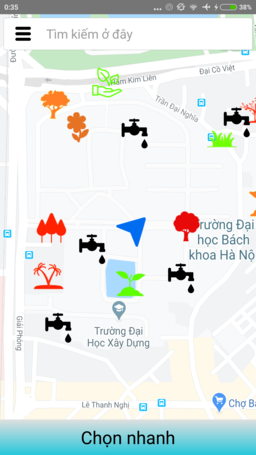

# HI_20172
> This is a project of the User Interface course in Hanoi University of Science and Technology (HUST).   This Android application help users watering plan in simulated park

## Installation
- This application was tested with Xiaomi Mi 4c (Android 5.1.1) but now it cannot run properly because Google Maps API need to be used with a billing account
## Features
- Simulate status of the plan
- Show position of user, taps, plans in map
- Find the shortest route from current position -> tap -> need watering plans
